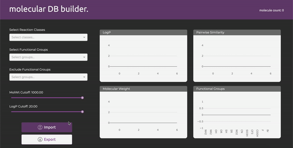

<div align="center">

</div>

### Installation

You can run the Dashboard locally by cloning and installing the dependencies:

```
pip install -r requirements.txt
```

Then start the app server:

```
python app.py
```

The app can now be found at http://localhost:8050/

### Installing RDKit

It is recommended that you install RDkit through Anaconda, though there are
[other options](https://rdkit.org/docs/Install.html).

```
$ conda install -c rdkit rdkit
```
